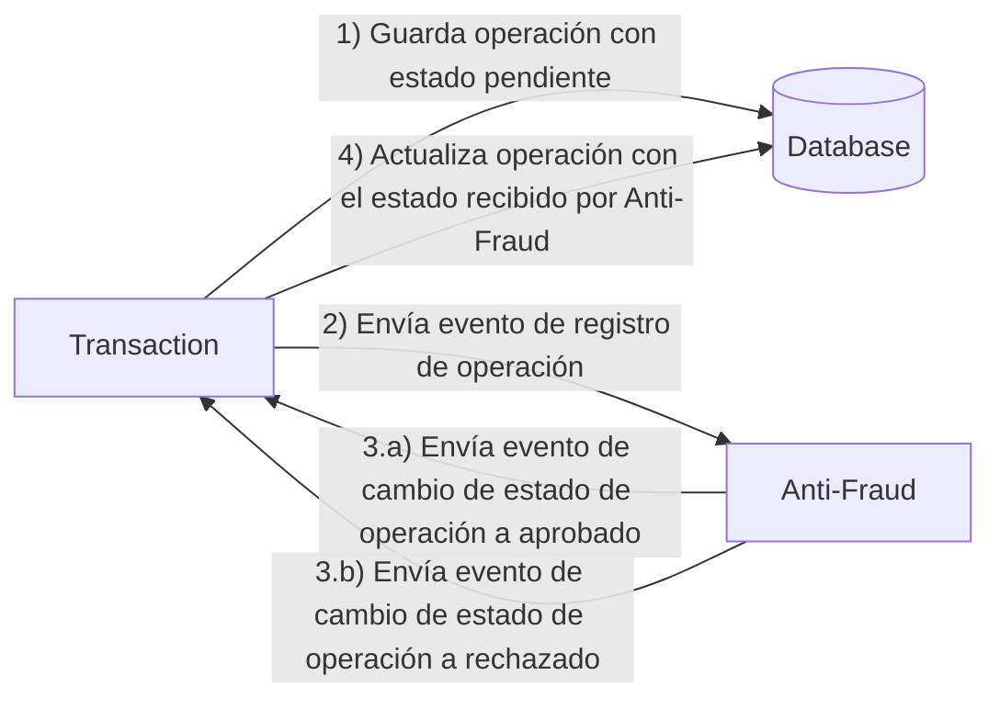

# Reto de programación en Java :rocket:

El reto de código que hemos elaborado nos permitirá conocer tus poderosas habilidades de codificación :smile:. 

Ten en cuenta que la forma correcta de enviar tu resolución es a través de un PR :wink: ... ¡Que te diviertas!

- [Problema](#problem)
- [Stack Tecnológico a utilizar](#tech_stack)
- [Envía tu código](#send_us_your_challenge)

# Problema

Cada vez que se crea una transacción (operación) financiera debe ser validada por nuestro microservicio antifraude (Anti-Fraud) y luego el mismo servicio envía un mensaje para actualizar el estado de la transacción.
Por ahora, solo manejamos tres estados de operación.

<ol>
  <li>pendiente</li>
  <li>aprobado</li>
  <li>rechazado</li>  
</ol>

Toda transacción con un valor mayor a 1000 debe ser rechazada.



# Stack Tecnológico a utilizar

<ol>
  <li>Java - Spring Framework - Spring Boot</li>
  <li>BD PostgreSQL</li>
  <li>Gestor de colas Kafka</li>    
</ol>

Nosotros estamos brindandote un `Dockerfile` para que rápidamente puedas configurar tu entorno de desarrollo.

Deberías tener 2 recursos (a nivel de API):

1. Recurso para crear una operación que contenga la siguiente estructura:

```json
{
  "accountExternalIdDebit": "Guid",
  "accountExternalIdCredit": "Guid",
  "tranferTypeId": 1,
  "value": 120
}
```

2. Recurso que recupera una operación

```json
{
  "transactionExternalId": "Guid",
  "transactionType": {
    "name": ""
  },
  "transactionStatus": {
    "name": ""
  },
  "value": 120,
  "createdAt": "Date"
}
```

## Opcional

Puede utilizar cualquier método para almacenar datos de transacciones, pero debe considerar que podemos lidiar con escenarios de gran volumen en los que tenemos una gran cantidad de escrituras y lecturas de los mismos datos al mismo tiempo. ¿Cómo abordaría este requisito?

# Envía tu código

Cuando termines tu resolución, después de realizar el fork al repositorio, tú **debes** abrir una solicitud de extracción (PR) a nuestro repositorio. No hay limitaciones para la implementación, puede seguir el paradigma de programación, la modularización y el estilo que creas que es la solución más adecuada.

Si tienes alguna duda, por favor ponte en contacto con nosotros.


# Curls usados
## caso 1: cuando el valor es mayor a 1000

curl --location --request POST 'http://localhost:8081/transactions' \
--header 'Content-Type: application/json' \
--data-raw '{
    "accountExternalIdDebit": "feae0e99-2050-4b2c-b344-4ca093ade411",
    "accountExternalIdCredit": "17b67b9b-8dd8-413e-9ede-c9451ad2363d",
    "transferTypeId": 1,
    "value": 1200.00
}'

## caso 2: cuando el valor es menor a 1000
curl --location --request POST 'http://localhost:8081/transactions' \
--header 'Content-Type: application/json' \
--data-raw '{
    "accountExternalIdDebit": "feae0e99-2050-4b2c-b344-4ca093ade411",
    "accountExternalIdCredit": "17b67b9b-8dd8-413e-9ede-c9451ad2363d",
    "transferTypeId": 1,
    "value": 750.00
}'

## visualizar una transacción
curl --location --request GET 'http://localhost:8081/transactions/49428321-8728-4780-a114-28c5ecb97713'


## captura de como llegaba la data a los topicos (se uso la herramienta Offset Explorer)


## sql - creacion de tabla transactions
<pre>
CREATE TABLE 
    transactions 
    ( 
        id                         CHARACTER VARYING NOT NULL, 
        account_external_id_debit  CHARACTER VARYING, 
        account_external_id_credit CHARACTER VARYING, 
        transfer_type_id           INTEGER, 
        value                      NUMERIC, 
        status                     CHARACTER VARYING, 
        created_at                 TIMESTAMP(6) WITH TIME ZONE, 
        PRIMARY KEY (id) 
    );

</pre>
